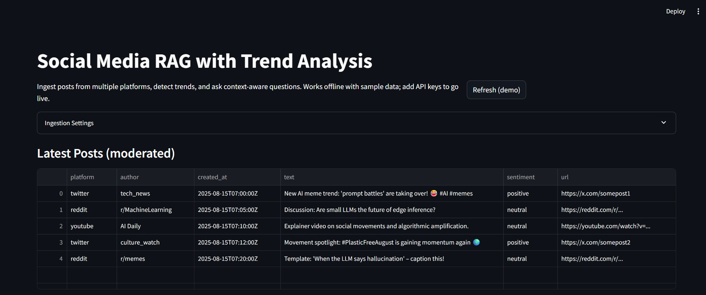
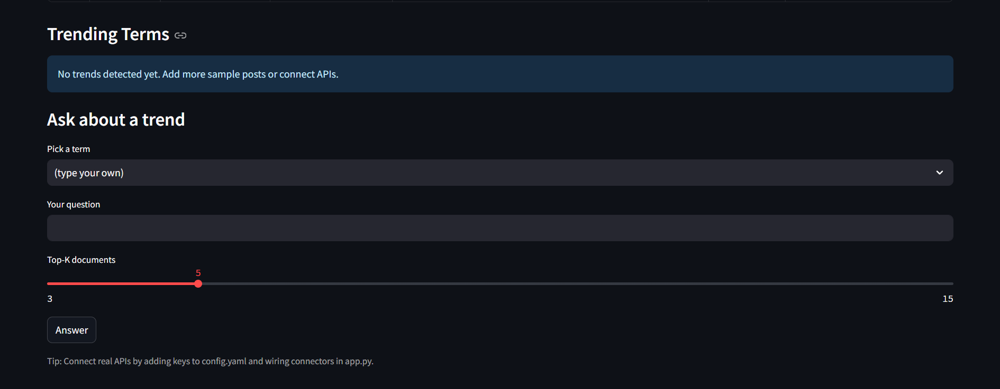

# Social Media RAG with Trend Analysis

A minimal, deployable demo that ingests social posts (real APIs or sample data), identifies trending topics, and provides context-aware answers using Retrieval-Augmented Generation (RAG). Built with **Streamlit**, **Sentence-Transformers**, and **ChromaDB**.

## Quickstart (Local)

```bash
# 1) Create env
python -m venv .venv && source .venv/bin/activate  # Windows: .venv\Scripts\activate

# 2) Install
pip install -r requirements.txt

# 3) (Optional) add keys to config.yaml
cp config.example.yaml config.yaml
# Edit config.yaml with your API keys (X/Twitter, Reddit, YouTube, OpenAI).

# 4) Run
streamlit run app.py
```

If you don't provide API keys, the app will run using `data/sample_posts.json` so you can demo the full flow.

## Features

- **Multi-platform ingestion**: X (Twitter), Reddit, YouTube. Falls back to sample data.
- **Trend detection**: streaming keyword frequencies + z-score bursts; n-gram phrase mining.
- **Moderation & sentiment**: open-source classifiers (toxic, hate) + VADER sentiment.
- **RAG**: Chroma vector store (FAISS-like) + MiniLM embeddings; context-aware generation (OpenAI if available, otherwise extractive).
- **Realtime-ish**: periodic refresh loop in Streamlit; alert thresholds configurable.
- **Evaluation**: lightweight RAG quality checks (RAGAS subset) and latency metrics.

## Repo Structure

```
.
├── app.py
├── requirements.txt
├── config.example.yaml
├── data/
│   ├── sample_posts.json
│   └── .gitkeep
└── src/
    ├── connectors/
    │   ├── twitter_connector.py
    │   ├── reddit_connector.py
    │   └── youtube_connector.py
    ├── processors/
    │   ├── text_clean.py
    │   ├── trend_detector.py
    │   ├── moderation.py
    │   ├── embedding.py
    │   └── rag.py
    ├── storage/
    │   └── vectorstore.py
    └── evaluation/
        └── evaluate.py
```

## Deploy

- **Streamlit Community Cloud**: push this repo → click "New app". Set `OPENAI_API_KEY` etc. in secrets.
- **HuggingFace Spaces (Gradio/Streamlit)**: upload repo; add secrets.
- **Docker** (optional): `docker run -p 8501:8501 -e OPENAI_API_KEY=... yourimage`.

## Notes

- This is a teaching demo: swap in production-grade queues (Kafka), workers (Celery), and a hosted vector DB (Pinecone/Weaviate) for scale.
- For fully offline demos, generation falls back to simple extractive summaries.





